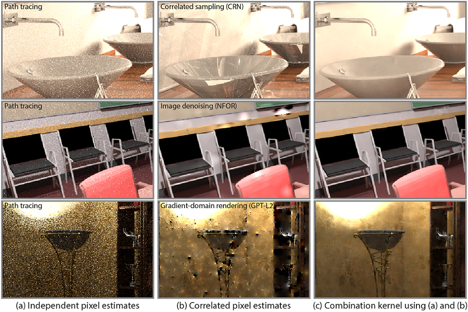

# [Deep Combiner for Independent and Correlated Pixel Estimates](https://cglab.gist.ac.kr/publications/2020_Deep_Combiner_for_Independent_and_Correlated_Pixel_Estimates.html)

[Jonghee Back](https://cglab.gist.ac.kr/people/), [Binh-Son Hua](https://sonhua.github.io/), [Toshiya Hachisuka](https://cs.uwaterloo.ca/~thachisu/), [Bochang Moon](https://cglab.gist.ac.kr/people/bochang.html)



## Overview
This code is the implementation of the method demonstrated in the paper [Deep Combiner for Independent and Correlated Pixel Estimates](https://cglab.gist.ac.kr/publications/2020_Deep_Combiner_for_Independent_and_Correlated_Pixel_Estimates.html).
For more details, please refer to a [project page](https://cglab.gist.ac.kr/publications/2020_Deep_Combiner_for_Independent_and_Correlated_Pixel_Estimates.html).

The code is implemented on Ubuntu 16.04 with TensorFlow 1.13.2, Python 3.5 and CUDA 10.0.
Furthermore, the code is tested on Ubuntu 16.04, 18.04 and 20.04. We tested the code on Nvidia graphics card with compute capability 6.1 and 7.5 (e.g., Nvidia GeForce GTX 1080, GTX 1080 Ti, RTX 2080 Ti and Quadro RTX 8000 Graphics cards). It is recommended to use a graphics card with 10GB or more for training and testing the provided codes with default setting.

If there is any problem, question or comment, feel free to contact us: **Jonghee Back** (jongheeback@gm.gist.ac.kr) 

## Usage
### Pre-requisites

Please install [docker](https://docs.docker.com/) and [nvidia-docker](https://github.com/NVIDIA/nvidia-docker).
The detailed instruction of the installation can be found:

- [Installation guide for docker](https://docs.docker.com/engine/install/ubuntu/)
- [Installation guide for nvidia-docker](https://docs.nvidia.com/datacenter/cloud-native/container-toolkit/install-guide.html#docker)

### Building Docker image

In order to build a docker image using the provided `Dockerfile`, please run this command:
```
docker build -t combiner .
```

After the docker image is built, main codes can be run in a new container as below:
```
nvidia-docker run --rm -v ${PWD}/data:/data -v ${PWD}/codes:/codes -it combiner
```

By using `run.sh`, the mentioned process can be run.

### Running

The provided codes for training or testing a network is available as follows:

1. Set `mode_setting` among three options (`MODE_DATA_GENERATION`, `MODE_TRAIN`, `MODE_TEST`) in `config.py`.
    - `MODE_DATA_GENERATION` : training dataset generation from exr images
    - `MODE_TRAIN` : training a network using generated dataset
    - `MODE_TEST` : testing a trained network
2. Choose `type_combiner` among two options (`TYPE_SINGLE_BUFFER`, `TYPE_MULTI_BUFFER`). Note that the provided pre-trained weights must be used differently depending on the type due to different number of parameters.
    - `TYPE_SINGLE_BUFFER` : single-buffered combination kernel
    - `TYPE_MULTI_BUFFER` : multi-buffered combination kernel (i.e., four buffers)
3. Check other configuration settings in `config.py`.
4. Run `tester.py`

### Using pre-trained weights

We provide two types of pre-trained weights: weights for single and multi-buffered combiner. When you unzip the files, please move `__train_ckpt__` folder into `data/` directory. The pre-trained weights can be downloaded using links below:

  - [Single-buffered combiner](https://drive.google.com/file/d/1mGMNrbB12NF9Im3dI5l96-QEysR74N49/view?usp=sharing)
  - [Multi-buffered combiner](https://drive.google.com/file/d/1wwJBmHE0B_-mXw6oP-Q7kVZrhDAEvtKk/view?usp=sharing)

### Sample data

The sample data consists of four types of correlated pixel estimates with corresponding independent pixel estimates: [Gradient-domain rendering with L1 and L2 reconstruction (GPT-L1 and GPT-L2)](https://github.com/mmanzi/gradientdomain-mitsuba), [Nonlinearly Weighted First-order Regression (NFOR)](https://github.com/tunabrain/tungsten/tree/master/src/denoiser) and [Kernel-Predicting Convolutional Networks (KPCN) denoisers](https://cvc.ucsb.edu/graphics/Papers/SIGGRAPH2017_KPCN/).

After you download the attached sample data, please move `__test_scenes__` folder into `data/` directory. Other settings for testing the sample data can be changed in `config.py`. The sample data can be available as below:

  - [Sample data (bathroom)](https://drive.google.com/file/d/1h439aKLZ8efx226X9q5m3aTTjMpzTvc6/view?usp=sharing)
  - [Sample data (bookshelf)](https://drive.google.com/file/d/1r5yREJQsgLLeoKCc3HfDkHFsDl24GRQa/view?usp=sharing)
  - [Sample data (conference)](https://drive.google.com/file/d/13j7aWX6bLfJqfNtB8Ed8HYnbm24kDCus/view?usp=sharing)
  - [Sample data (kitchen)](https://drive.google.com/file/d/1QwMiUrqPGplB8HZ6gDHHaMwBnRle2S8g/view?usp=sharing)


## License

All source codes are released under a BSD License. Please refer to [our license file](https://github.com/CGLab-GIST/deep-combiner/blob/master/license) for more detail.


## Citation

If you use our code or paper, please check below:
```
@article{Back20,
  author = {Back, Jonghee and Hua, Binh-Son and Hachisuka, Toshiya and Moon, Bochang},
  title = {Deep Combiner for Independent and Correlated Pixel Estimates},
  year = {2020},
  issue_data = {December 2020},
  volume = {39},
  number = {6},
  journal = {ACM Trans. Graph.},
  month = nov,
  articleno = {242},
  numpages = {12}
}
```


## Credits

A code about various exr I/O operations (`exr.py` in `code/` directory) credits to [Kernel-Predicting Convolutional Networks (KPCN) denoiser](https://cvc.ucsb.edu/graphics/Papers/SIGGRAPH2017_KPCN/) project.


## Release Notes
### v1.0

Initial version
